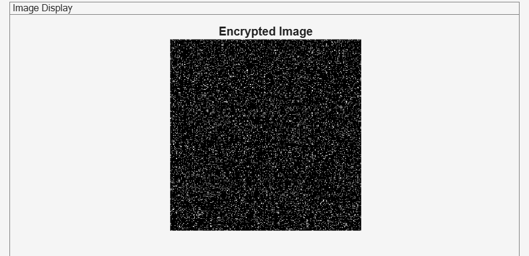
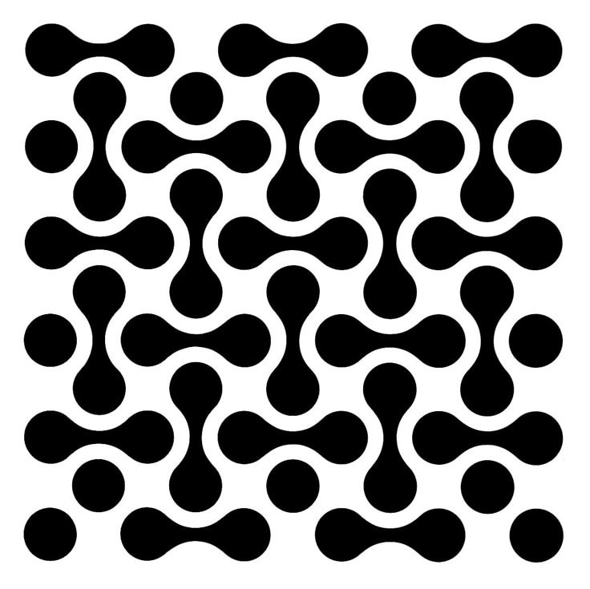
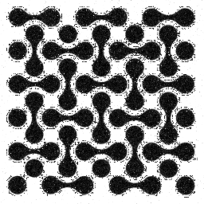
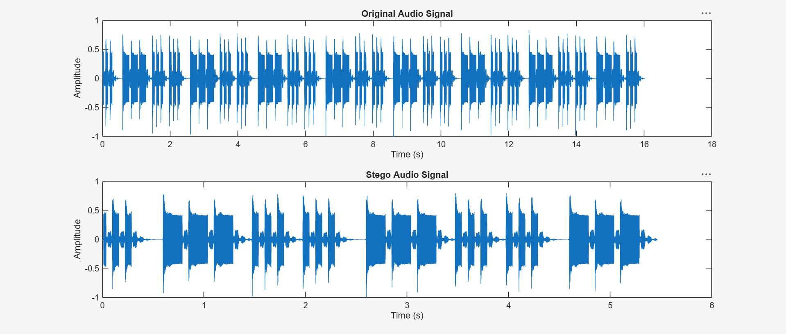
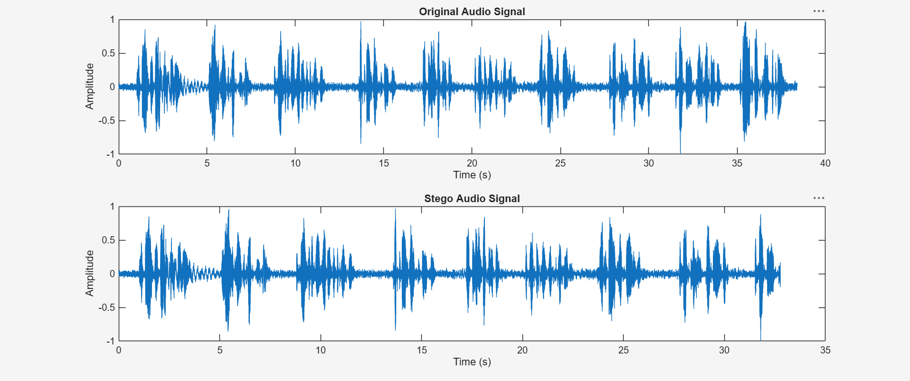
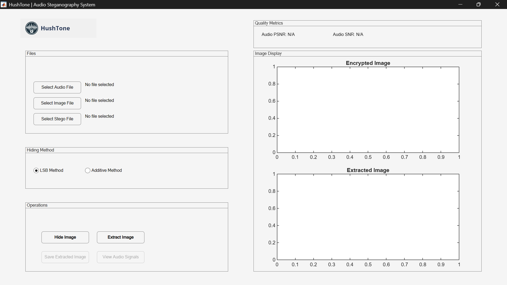

# 🛡️ HushTone: Audio Steganography System (Documentation & Results)


## 📌 Notice on Repository Content
> **Confidentiality & Scope Notice:** This repository contains the **project documentation, system interface previews, evaluation metrics, and experimental results only**. The core source code (`.m` files, GUI layout files, and proprietary embedding parameters) is kept private and proprietary to protect intellectual property for academic and capstone grading purposes.

---

## 📖 Project Overview

### What is HushTone?
**HushTone** is a MATLAB desktop application designed to securely hide confidential and sensitive images, such as military diagrams, medical scans, financial charts inside audio files. The main goal is to enable highly secure, covert communication with large data capacity while keeping the modified audio sound completely natural and indistinguishable to the human ear.

### Core Objectives
1. **Confidentiality:** Protect sensitive images by embedding them into everyday audio files using secure cryptographic steps.
2. **Transparency:** Ensure that the modified audio sounds identical to the original audio without raising any suspicion.
3. **Robustness:** Extract and recover the hidden images clearly with minimal noise and high visual quality.

---

## ⭐ Key Features

* **Flexible Hiding Methods:** Supports multiple robust embedding techniques for secure data concealment.
* **Enhanced Security:** Implements advanced cryptographic and shuffling keys to protect hidden payloads.
* **Interactive GUI:** A user-friendly desktop interface to manage files, configure settings, and preview results instantly.
* **Performance Metrics:** Automatically calculates evaluation metrics for audio fidelity and image correlation.
* **Advanced Post-Processing:** Applies smart thresholding on extracted images to remove background noise and produce clean, high-contrast visuals.
---

## 🛠️ System Requirements & Environment

### Software & Toolboxes
* **Environment:** MATLAB (R2021b or later recommended)
* **Required Toolboxes:** 
  * Wavelet Toolbox (for 2D Discrete Wavelet Transform `dwt2`)
  * Signal Processing Toolbox
* **Supported Formats:** 
  * Audio: `.wav` (Uncompressed PCM recommended)
  * Images: `.png`, `.jpg`, `.bmp`

### Hardware Specifications
* **Processor:** Intel Core i5 / AMD Ryzen 5 or higher.
* **RAM:** Minimum 8 GB RAM (16 GB recommended for matrix computations).
* **Display:** Standard desktop display supporting MATLAB GUI layouts.

---

## 🖼️ Results Showcase

This section displays the system interface, audio comparisons, and extracted image results:

### 1. Audio Samples Preview (Before & After Embedding)

* **Note:** The audio clips have a strong audio level; please lower your device's volume if you have sound sensitivities before playing. Listen directly to compare transparency:

* **Example A: Morse Code Signals**
  * **Original Audio:** [Download / Listen to original_audio_sample_sm1.mp3](test_assets/audio/original_audio_sample_sm1.mp3)
  * **Stego Audio:** [Download / Listen to stego_audio_output_sm1.wav](test_assets/audio/stego_audio_output_sm1.wav)

* **Example B: Human Speech (Voice Sample)**
  * **Original Audio:** [Download / Listen to original_audio_sample_sm2.wav](test_assets/audio/original_audio_sample_sm2.wav)
  * **Stego Audio:** [Download / Listen to stego_audio_output_sm2.wav](test_assets/audio/stego_audio_output_sm2.wav)
---

### 2. Encrypted Image:



The visual data is completely scrambled into a random, noise-like pattern of black and white pixels. This ensures that unauthorized users cannot recognize or interpret the hidden content if intercepted, providing strong confidentiality before the image is concealed inside the audio file

---

### 3. Test Case 1: National Emblem Extraction
| Original Image | Extracted Result |
| :---: | :---: |
|  |  |

Side-by-side comparison showing the successful recovery of the national emblem. High textual and graphical clarity is achieved because the DWT-SVD coefficients preserved the structural edges, while custom thresholding effectively suppressed background noise and prevented unwanted artifacts. (`logo_national_emblem.png` vs `extracted_national_emblem.png`).

---

### 4. Test Case 2: Geometric Pattern Extraction
| Original Image | Extracted Result |
| :---: | :---: |
|  |  |

Demonstrates edge-preservation and boundary definition using a complex geometric test pattern. Minor scaling or pixel intensity shifts during inverse SVD calculations are filtered out via dynamic range mapping, yielding a clean, high-contrast final output without degradation (`pattern_geometric.png` vs `extracted_geometric.png`).

---

### 5. Audio Signal Waveform Comparison




This graph illustrates a time-domain comparison between the original audio signal and the modified stego audio signal across a duration of 0 to 5.5 seconds. The key takeaway is the remarkable visual similarity and near-identical match between both waveforms, which proves that the data embedding process successfully concealed the payload without causing any noticeable distortion or altering the natural structure of the audio.

---

### 6. System Graphical User Interface (GUI)



The main MATLAB desktop application layout showing file selection panels, hiding methods, operation triggers, and real-time performance metric display areas.

---

## 📊 Experimental Evaluation & Results

The system was tested to validate audio transparency and image recovery accuracy.

### 1. Audio Quality & Transparency Evaluation
Comparing the original audio with the stego-audio using Peak Signal-to-Noise Ratio (**PSNR**) and Signal-to-Noise Ratio (**SNR**) confirms negligible acoustic distortion.
* **Audio PSNR:** $\approx 42.11 \text{ dB}$ to $42.22 \text{ dB}$ (High signal fidelity).
* **Audio SNR:** $\approx 29.32 \text{ dB}$ to $29.44 \text{ dB}$ (Low noise introduction).

### 2. Image Extraction & Robustness Summary

| Test Case ID | Payload Description | Embedding Method | Audio PSNR | Audio SNR | Extraction Status & Visual Quality |
| :--- | :--- | :--- | :--- | :--- | :--- |
| **TC-01** | National Emblem (`logo_national_emblem.png`) | Additive / SVD | 42.22 dB | 29.44 dB | **High Clarity:** Details fully recovered with clean background suppression. |
| **TC-02** | Geometric Pattern (`pattern_geometric.png`) | Additive / SVD | 42.11 dB | 29.32 dB | **Excellent Structure:** Perfect edge preservation and boundary definition. |

---

## 📂 Test Assets & Naming Convention

All evaluation audio clips, payload images, and output results are organized under the following directory structure:

```text
HushTone-GP-Documentation/
│
├── test_assets/
│   ├── audio/
│   │   ├── original_audio_sample_sm1.wav       # Original host audio before embedding
│   │   └── stego_audio_output_sm1.wav          # Modified audio containing the hidden payload
│   │   ├── original_audio_sample_sm2.wav       
│   │   └── stego_audio_output_sm2.wav          
│   ├── images/
│   │   ├── encrypted_image.png             # Encrypted Image
│   │   ├── national_emblem.png             # Original Test Case 1: National Emblem
│   │   ├── pattern_geometric.png           # Original Test Case 2: Geometric Pattern
│   │   ├── extracted_national_emblem.png   # Extracted result for Test Case 1
│   │   └── extracted_geometric.png         # Extracted result for Test Case 2
│   └── waveforms/
│       ├── audio_signals_comparison_sm1.png    # Time-domain waveform comparison plot
│       ├── audio_signals_comparison_sm2.png    
│       └── system_gui_interface.png        # Complete MATLAB GUI application layout
│
└── README.md
